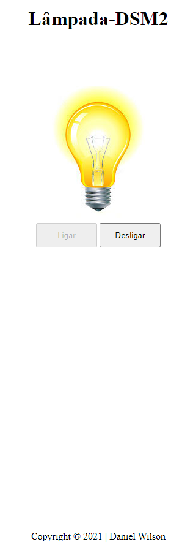

# Lâmpada - DS2M

Projeto criado com o objetivo didático para as aulas de Programação Web Front End do curso desenvolvimento de sistemas [SENAI Jandira](https://jandira.sp.senai.br/) sobre a orientação do professor [Fernando Leonid]()

O projeto consiste em criar uma lampada que tenha tres ações:Ligar,Desligar e quebrar,utilizando vários eventos

Código foi construido pensando em boas prática,como responsabilidade única e funções puras.

